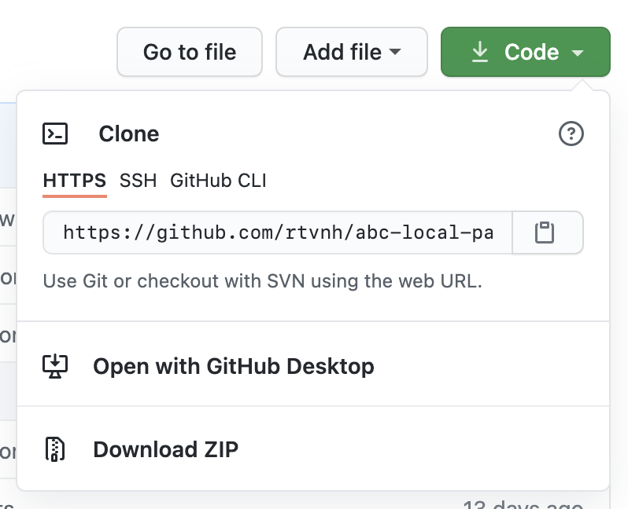

# ABC Manager - Local Partner - WordPress Plugin

WordPress Plugin to post new updates to the ABC Manager of NH/AT5

## Setup

> This plugin requires you to have the following minimal requirements
> > PHP: **7.3** | WordPress: **5.7**

### Download and installation

You can download this plugin via the `Code` button and then select `download zip`

To install the plugin into your WordPress environment you go to `Plugins -> Add New -> Upload Plugin`. Here you can
select the downloaded ZIP file and click `Install Now`

## Activate Plugin

To activate the plugin you can go to the plugins overview and select `Activate`

## Plugin settings

You can find the settings of the plugin in `Settings -> ABC Manager`. The values of the settings you have to fill in
have been given to you by your contact person from NH Nieuws. If you entered the correct credentials the  ABC Manager
status should be `UP` and the Credentials should be `Valid`

---

## How it works

Every time you publish and new article or update a published article this article will be send to ABC Manager.
Upon receipt, the article will be reviewed bij the editors and they will be able to publish the article.
Image/Video/Audio files will be uploaded in their own system so you don't have to worry about increased network traffic.

If NH Nieuws publishes an article about your region, this article will be automatically send to your WordPress environment.
Dependable on the settings in ABC Manager the article will get the status `Published` or `Draft`

### Errors

Do you have problems installing the plugin or experience errors in the syncing of the articles, please contact
[NH Nieuws](https://www.nhnieuws.nl/contact).

&copy;  NH Media

## Dutch documentation

Voor de Nederlandse
documentatie, [klikt u hier](https://github.com/rtvnh/abc-local-wp-custom/blob/develop/docs/nl.md).
