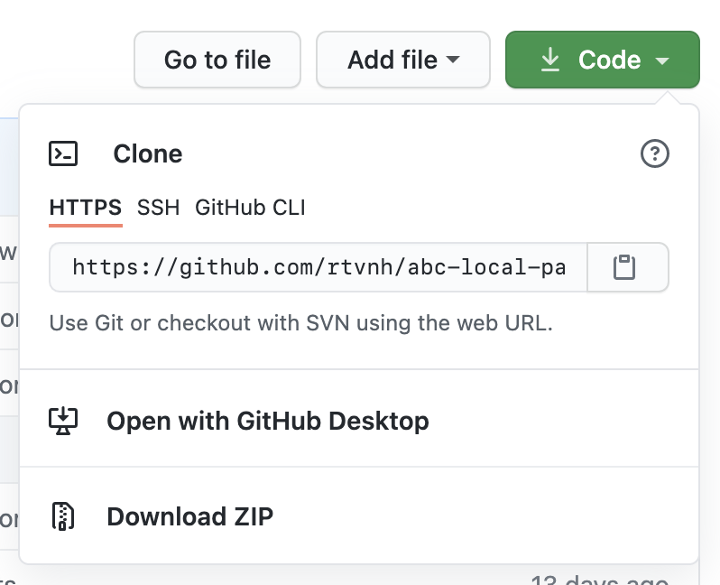
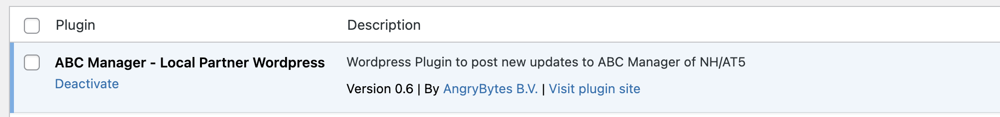
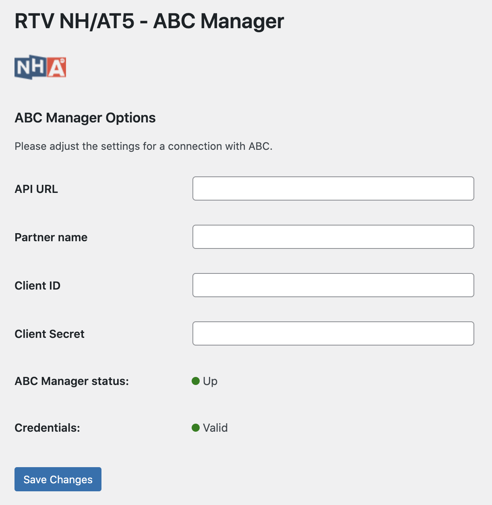

# ABC Manager - Lokale Partner - Wordpress Plug-in

Deze plugin zorgt voor de communicatie tussen Wordpress en ABC Manager. ABC Manager is het redactionele systeem van NH Nieuws en AT5

## Installatie

> Deze plug-in draait volgens minimale vereisten, verwacht wordt dat uw WordPress installatie aan de volgende eisen voldoet.
> > PHP: **7.3** | WordPress: **5.7**

### Downloaden en handmatige installatie

Deze plugin kunt u downloaden via de Code knop en vervolgens download zip te selecteren.

Om de plugin te installeren gaat u in WordPress naar `Plugins -> Add New -> Upload Plugin`. Hier kunt u vervolgens het
gedownloade ZIP bestand selecteren en op `Install Now` klikken.

## Plugin activeren

Om een werkende plugin te krijgen, dient deze geactiveerd te worden in het plugins overzicht.

## Instellingen van de plugin

De instellingen van de plugin zijn te vinden via `Settings -> ABC Manager`. De gegevens die hier ingevuld moeten worden
heeft u gekregen via uw contactpersoon bij NH Nieuws. Als alles correct is ingevuld zal de ABC Manager status `UP` zijn
en de Credentials `Valid`

---

## Werking plugin

Iedere keer als u een nieuw artikel gepubliceerd dan wordt deze automatisch verstuurd naar ABC Manager.
Na ontvangst wordt het artikel gereviewd door de redactie en kunnen ze het publiceren. Foto's/Videos/Audio bestanden
worden automatisch meegenomen. Er hoeft namens een redacteur/schrijver van uw omroep/organisatie geen extra actie
te worden gedaan.

Als er in ABC Manager een artikel wordt gepubliceerd over uw regio dan wordt dit artikel automatisch naar uw wordpress
omgeving verstuurd. Afhankelijk van de instellingen in ABC Manager krijgt het artikel de status `Published` of `Draft`.

### Fouten/Problemen

Mocht u niet uit deze documentatie komen en heeft u hulp nodig? Neem dan contact op met
[NH Nieuws](https://www.nhnieuws.nl/contact).

&copy;  NH Media
